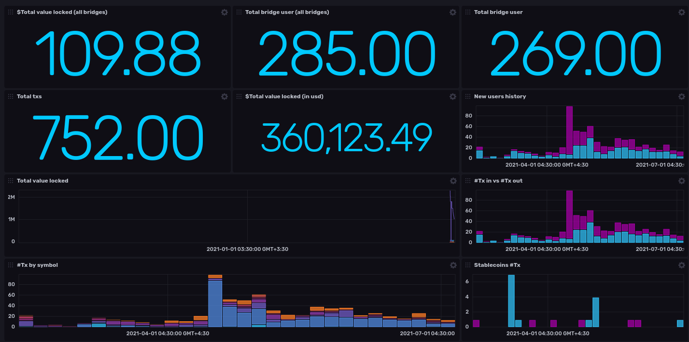

# Go Iotube analytics
A fast, lightweight [Iotube](https://tube.iotex.io/) bridge analytics and API.
## Features
+ Component based design to easily add new bridges
+ Low resource usage
+ Reduced on-chain calls

## Time-series database
This project uses [InfluxDB](https://influxdb.com) to save the time series data. InfluxDB empowers developers to build IoT, analytics and monitoring software. It is purpose-built to handle the massive volumes and countless sources of time-stamped data produced by sensors, applications and infrastructure.
## Design


## Frontends
### React frontend
A react frontend was developed to show statistics to the end user. see dashboard [here](https://IoTube-analytics.github.io/react-iotube-analytics), source codes are available [here](https://github.com/IoTube-analytics/react-iotube-analytics).  
Frontend overview:

### Influxdb dashboard
Influxdb dashboards are a great way to visualize data. Here we provided an influxdb dashboard as to query the time series and even craft new ideas based on time series.
See this example [influxdb_ethiotex_board.json](assets/influxdb_ethiotex_board.json).  
InfluxDB dashboard overview:

## Quickstart 
### Setup required environment variables
```sh
$ cp env.example .env # edit and add postgres credentials
```
### Deploy using docker-compose
```sh
$ docker-compose up -d --build 
```
### Build manually
```sh
$ make lint # (optional)
$ make build
```
## How it works!
Here are brief explanations about different components of this project.
### Bridge trackers
Bridge trackers are the core components of this project and are located in the `pkg/bridge` directory. for every bridge there is `<network-name>` subdirectory there, that contains two packages for different directions of the bridge transactions. For example `pkg/bridge/eth/ethiotex` tracks the  bridge transactions from ethereum to iotex network and the `pkg/bridge/eth/iotexeth` package handles transactions in the opposite way.  
For every bridge we tracks two main records. 
1. `depositTo` method calls to the cashier contract 
2. Total value locked in token safe contract (we collect token data from token list contracts) 
### Store
[Store](pkg/bridge/store.go) is the component responsible for saving bridge data to the influxdb.
### Price tracker (Optional)
Price tracker is responsible for retrieving price informations for different coin symbols. this will allow us to do aggregations on the influxdb side and results to faster overall aggregations for the `tvl` time series.


